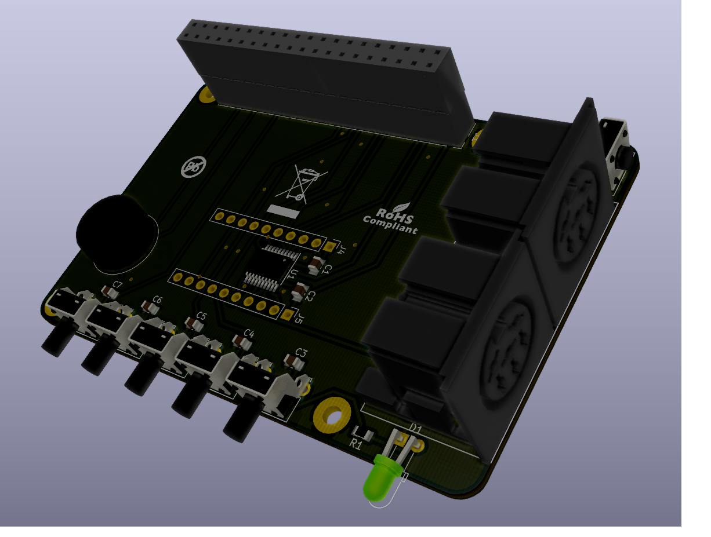

# Pi1541-Raspberry-Pi-Hat
Raspberry Pi Hat for the Commodore 1541 disk drive emulator from Steve White (https://cbm-pi1541.firebaseapp.com)

# Attention: Preparation for new release!

Unfortunately, the GPIOs of the Raspberry PI are very sensitive. And the load-bearing capacity is also very low. If you have a large number of devices on the IEC bus, the Raspberry may be damaged. That is why I am in the process of making various changes.

Among other things, a corresponding voltage translator is now used, which also protects against ESD influences and prevents excessive current consumption.

 
Steve White has presented a project on his website (https://cbm-pi1541.firebaseapp.com/), which reproduces a Commodore Floppy 1541 cycle exactly. 

My project here is an essay for the Raspberry PI to provide the necessary interfaces and controls.

This is the back of the board:

I put the necessary Gerber files to create a board here. The parts list (BOM)looks like this:

|Name|Component|Package|Value|
--- |--- | --- | ---
|D|LED red|3mm|-|
|J1|PinSocket Isolation Height: 11.05mm|2,54mm|2x20pins|
|J2, J3|DIN 6pins Socket Lumberg 010599|-|-|
|Piezo1|Piezo TDK PS1240P02BT|-|-|
|Q1 - Q4|BS170 Transistor|TO92|-|
|R1 - R5|Resistor 1/4W, 5%|0207|10k|
|RN1|Resistor Array|SIP5|10k|
|SW1 - SW5|SPST Angled PTS645Vx83|-|-|
|SW6|SPST Angled PTS645Vx39|-|-|

Soon I will also publish the KiCad project for this board. 

Direct links to order PCBs: 

<a href="https://oshpark.com/shared_projects/2aZQfJjQ"></img></a>
 
<a href="https://www.pcbway.com/project/shareproject/W113176ASH9_Pi1541_Ad_on_Board.html"></img></a>
