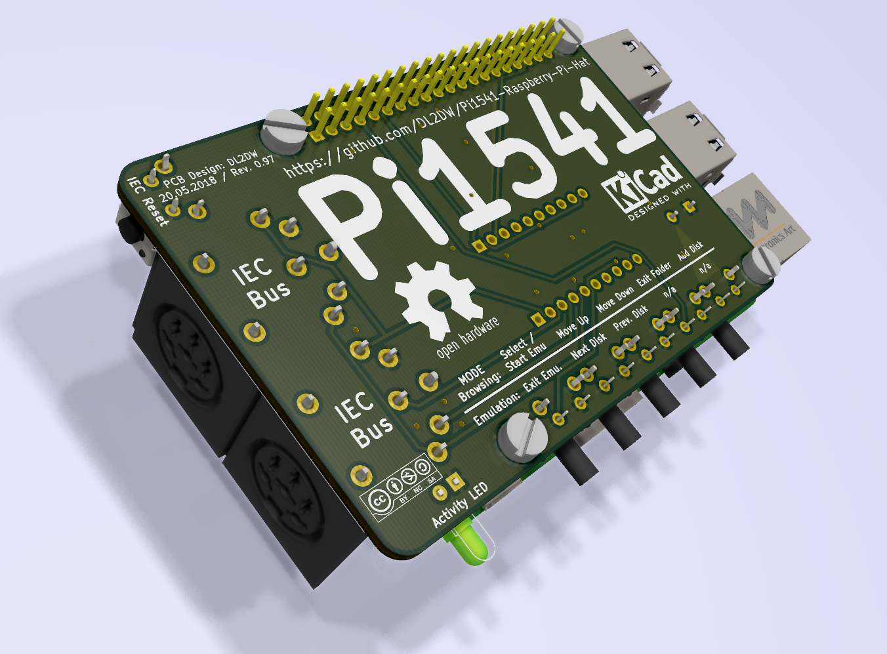

# Pi1541-Raspberry-Pi-Hat
Raspberry Pi Hat for the Commodore 1541 disk drive emulator from Steve White (https://cbm-pi1541.firebaseapp.com)

 
Steve White has presented a wonderful project on his website (https://cbm-pi1541.firebaseapp.com/), which reproduces a Commodore Floppy 1541 cycle exactly. 

My project here is an essay for the Raspberry PI to provide the necessary interfaces and controls.

# The whole thing is still in beta status and a replica is at your own risk!

I put the necessary Gerber files to create a board here. The parts list (BOM)looks like this:

|Name|Component|Package|Value|
--- |--- | --- | ---
|D|LED red|3mm|-|
|J1|PinSocket Isolation Height: 11.05mm|2,54mm|2x20pins|
|J2, J3|DIN 6pins Socket Lumberg 010599|-|-|
|Piezo1|Piezo TDK PS1240P02BT|-|-|
|Q1 - Q4|BS170 Transistor|TO92|-|
|R1 - R5|Resistor 1/4W, 5%|0207|10k|
|RN1|Resistor Array|SIP5|10k|
|SW1 - SW5|SPST Angled PTS645Vx83|-|-|
|SW6|SPST Angled PTS645Vx39|-|-|

Soon I will also publish the KiCad project for this board. 

Direct links to order PCBs: 

<a href="https://oshpark.com/shared_projects/hk2rCPFI"></img></a>
 
<a href="https://aisler.net/p/SNNWFCDJ"></img></a>
 
<a href="https://www.pcbway.com/project/shareproject/W113176ASH8_Pi1541_Ad_on_Board.html"></img></a>
